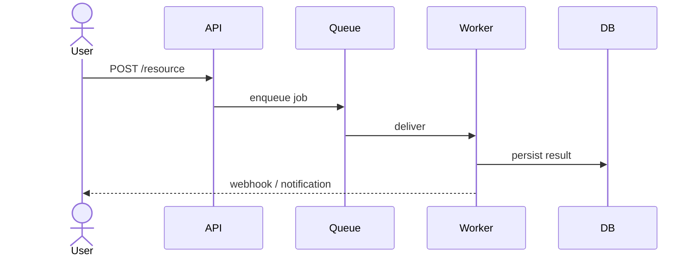

# Flow Extractor

Identify the **main flows** in a system — user-facing scenarios, background jobs, integration paths — and document each one as a structured, scannable artifact. The goal is a flow map a new engineer can read in 5 minutes and use as a navigation index into the code.

## When to Use

- User says "выдели/опиши основные флоу", "map the main flows", "what are the core scenarios"
- Onboarding to a new codebase after `codebase-onboarding`: flows are the next layer of detail
- Before refactoring: knowing the flows constrains what can change safely
- Before writing an RFC or design doc that touches multiple flows
- When researching a domain (e.g. audience platform, target integration) and need a flow inventory

## Inputs

The skill works from any combination of:
- A codebase (read entry points, routers, controllers, queue consumers, cron jobs)
- Architecture notes / design docs in markdown (e.g. `02-architecture/*.md` in this repo)
- A user-provided list of features or capabilities

If only one is available, use it. If multiple are available, cross-check: code is the source of truth for **what exists**, docs are the source of truth for **intent**.

## How It Works

### Phase 1 — Discover candidate flows

Look for entry points and triggers — these are flow starts:

```
HTTP/API   → route handlers, controllers, GraphQL resolvers, gRPC services
UI         → top-level pages, navigation entries, primary CTAs
Async      → queue consumers, Kafka topics, pub/sub subscribers, cron jobs
Webhooks   → inbound integration handlers
CLI        → command entry points
Scheduled  → cron, k8s CronJob, Airflow DAGs
```

Group related entry points into **flows**. A flow = one coherent scenario, not one endpoint. Example: "Create audience" may span `POST /audiences`, a background compute job, and an export step — that is ONE flow with three stages, not three flows.

### Phase 2 — Rank by importance

Not every flow deserves equal documentation. Rank by:

1. **Business criticality** — does revenue / SLA depend on it?
2. **Frequency** — how often does it run?
3. **Blast radius** — how many components does it touch?
4. **Change rate** — is it actively evolving or stable?

Pick the top 5-10. List the rest by name only ("other flows") so the reader knows the inventory is complete.

### Phase 3 — Document each flow

For each main flow, produce:

```markdown
## Flow: <Name>

**Trigger**: <what starts this flow — user action, schedule, event>
**Owner**: <team or service, if known>
**Criticality**: <high | medium | low> — <one-line justification>

### Steps
1. **<Stage name>** — <what happens> (`path/to/code.ts:42`)
2. **<Stage name>** — <what happens> (`path/to/file.go:101`)
3. ...

### Dependencies
- Services: <list>
- Datastores: <list>
- External APIs: <list>

### Failure modes
- <What can fail and what the user/system observes>

### Sequence

```

Code references must be **clickable** — use `path/to/file.ext:line` format. If a flow exists only in docs (not in code), say so explicitly.

### Phase 4 — Produce the flow index

A single file (default: `docs/flows/README.md` or, in a notes repo, `01-context/flows.md`) that lists all flows with a one-line summary and a link to the per-flow detail. This is the navigation entry point.

```markdown
# Flow Map

| # | Flow | Trigger | Criticality | Detail |
|---|------|---------|-------------|--------|
| 1 | Create audience | `POST /audiences` | High | [→](./flow-01-create-audience.md) |
| 2 | Compute audience | Scheduled | High | [→](./flow-02-compute.md) |
| 3 | Export to Target | Async event | High | [→](./flow-03-export.md) |
| ... | | | | |

**Other flows** (not deeply documented): admin-only mutations, deprecated v1 endpoints, internal debug routes.
```

## Best Practices

1. **A flow is a scenario, not an endpoint.** If three endpoints serve one user goal, that's one flow with three stages.
2. **Anchor every step in code.** A flow without file:line refs is fiction — it cannot be verified or maintained.
3. **Sequence diagrams over prose.** A 6-line Mermaid diagram beats three paragraphs of narrative.
4. **Be honest about gaps.** If you cannot find where a step is implemented, write "unclear — needs investigation" rather than guessing.
5. **Don't over-document.** 10 flows × 30 lines each is digestible; 40 flows × 100 lines is unread.

## Anti-Patterns to Avoid

- One flow per endpoint — produces a phone book, not a map
- Mermaid diagrams that just restate the bullet list — use diagrams to show **interaction**, not to repeat steps
- Listing every helper function called along the way — keep stages at the level of "what" not "how"
- Documenting flows that no longer exist — verify the entry point still routes somewhere

## Output Locations

- Code repo: `docs/flows/README.md` + `docs/flows/flow-NN-<name>.md`
- Notes/learning repo: `01-context/flows/` or alongside existing context files
- Ask the user before creating a new directory if the project already has a docs structure

## Examples

### Example 1: Notes repo with architecture docs only
**User**: "Выдели основные флоу из 02-architecture/"
**Action**: Read all `02-architecture/*.md`, identify scenarios mentioned (compute, export, freshness, etc.), produce `01-context/flows.md` index + per-flow files. No code refs available — note this explicitly and link to the source markdown sections instead.

### Example 2: Codebase with API + workers
**User**: "Map the main flows in this service"
**Action**: Phase 1 finds 12 HTTP routes + 3 queue consumers + 1 cron. Phase 2 ranks → 6 main flows. Phase 3 produces 6 detail files with `file:line` refs and Mermaid diagrams. Phase 4 produces the index.

### Example 3: Mixed sources
**User**: "Опиши как работает создание аудитории end-to-end"
**Action**: Single flow, deep dive. Use docs for intent, code for verification. Output: one detailed flow doc, no index.
